# Agentic Architecture

## Overview
The FinTerra platform uses a multi-agent architecture where main agents delegate research tasks to specialized sub-agents, then synthesize findings to provide user responses.

```mermaid
graph TB
    subgraph "User Interactions"
        User[👤 User]
        Chat[💬 FloatingChat UI]
    end

    subgraph "Main Agents"
        IA[Investment Analyzer Agent]
        CA[Consultant Agent]
        BA[Budget Analyzer Agent]
    end

    subgraph "Research Sub-Agents"
        MR[Market Researcher]
        DR[Diversification Researcher]
        RR[Risk Researcher]
        BR[Budget Researcher]
        SR[Savings Researcher]
    end

    subgraph "Data Layer"
        ID[(Investment Data)]
        BD[(Budget Data)]
        ND[(Networth Data)]
        AD[(Activity Data)]
    end

    subgraph "Response Generation"
        RAG[RAG Context Builder]
        Synthesis[Response Synthesizer]
    end

    User --> Chat
    Chat --> IA
    Chat --> CA
    Chat --> BA

    IA --> MR
    IA --> DR
    IA --> RR
    MR --> ID
    DR --> ID
    RR --> ID

    BA --> BR
    BA --> SR
    BR --> BD
    SR --> BD

    MR --> RAG
    DR --> RAG
    RR --> RAG
    BR --> RAG
    SR --> RAG

    RAG --> Synthesis
    Synthesis --> IA
    Synthesis --> CA
    Synthesis --> BA

    IA --> Chat
    CA --> Chat
    BA --> Chat
    Chat --> User

    style IA fill:#28ce78,stroke:#1ea560,stroke-width:3px
    style CA fill:#28ce78,stroke:#1ea560,stroke-width:3px
    style BA fill:#28ce78,stroke:#1ea560,stroke-width:3px
    style MR fill:#3b82f6,stroke:#2563eb,stroke-width:2px
    style DR fill:#3b82f6,stroke:#2563eb,stroke-width:2px
    style RR fill:#3b82f6,stroke:#2563eb,stroke-width:2px
    style BR fill:#3b82f6,stroke:#2563eb,stroke-width:2px
    style SR fill:#3b82f6,stroke:#2563eb,stroke-width:2px
    style RAG fill:#f59e0b,stroke:#d97706,stroke-width:2px
    style Synthesis fill:#ef4444,stroke:#dc2626,stroke-width:2px
```

## Agent Flow

### Investment Analyzer Workflow

### Consultant Agent Workflow

## Research Question Generation

Each main agent automatically generates research questions based on:

1. **User Query**: What the user is asking about
2. **Available Data**: What financial data is accessible
3. **Historical Context**: Previous interactions and patterns
4. **Agent Expertise**: Domain-specific knowledge areas

Example research questions for Investment Analyzer:
- Market Researcher: "What are current market trends in tech sector?"
- Diversification Researcher: "How is the portfolio allocated across asset classes?"
- Risk Researcher: "What are the concentration risks in current holdings?"

## RAG Context Building

The RAG (Retrieval Augmented Generation) system:
1. Takes research questions from sub-agents
2. Retrieves relevant data from the data layer
3. Formats context for the synthesizer
4. Includes timestamps and data provenance

## Response Synthesis

The synthesizer combines:
- Research findings from sub-agents
- User's financial data
- Agent's domain expertise
- Conversation context

To produce:
- Concise, jargon-free responses
- Specific, actionable recommendations
- Familiar, advisor-like tone
